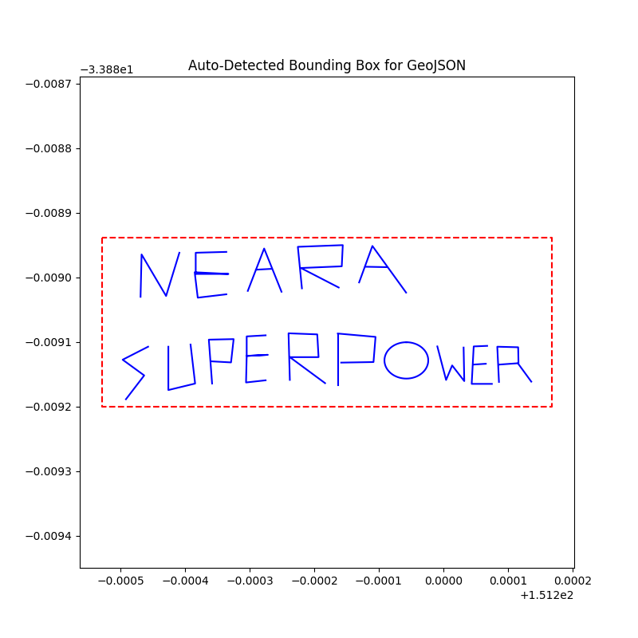

# GeoJSON Word Detector

A Python tool for visualizing and inspecting hidden messages in GeoJSON files — originally built to reveal a word (or secret message) drawn using `LineString` and `Polygon` features.

---

## 📁 Project Structure

```bash
geojson-word-detector/
├── grad-challenge.geojson     # The GeoJSON file containing the hidden message
├── main.py                    # Core visualizer for showing features inside a bounding box
└── mainEasterEgg.py           # Full scanner that detects all geometry types and suspicious shapes
```

### What It Does
```main.py```
- Loads grad-challenge.geojson
- Automatically extracts all coordinates
- Filters and plots only the features that intersect with that box
- Used to isolate and reveal part of the hidden word

#### Discovery Journey (with Visuals)
**Manual Bounding Box – Partial View (PWER)**
We started by defining a static bounding box manually:
``` python
polygon_coords = [
    (151.19982759600163, -33.889076995548066),
    (151.19982759600163, -33.88917835060116),
    (151.20015211737098, -33.88917835060116),
    (151.20015211737098, -33.889076995548066),
    (151.19982759600163, -33.889076995548066)
]
```
This gave us a cropped view, cutting off the "O" completely:


After slightly adjusting the coordinates, we captured the full lower line:


**Auto Bounding Box – Revealed Full Message**
We then added logic to automatically calculate the bounding box from all coordinates and apply padding. This revealed the entire drawing:


```python
# Define bounding polygon using auto-detected bounds
polygon_coords = [
    (min_lon, max_lat),
    (min_lon, min_lat),
    (max_lon, min_lat),
    (max_lon, max_lat),
    (min_lon, max_lat)
]
```


```mainEasterEgg.py```
After discovering the full message, we took it a step further to verify if anything was hidden:
This script:
- Loads and plots all geometry types: LineString, Polygon, MultiLineString, Point
- Detects tiny features (e.g. microscopic lines or dots)
- Prints geometry types and counts
    - Flags:
        - Suspiciously small areas/lengths
        - Points that fall outside the main drawing
- Helps rule out any “easter eggs” or hidden elements


### Requirements
pip install shapely matplotlib

# Visualize manually selected portion
python3 main.py

# Run full-feature scan (auto-detect bounding box + easter eggs)
python3 mainEasterEgg.py

### What I Found
- The GeoJSON file draws two words using line features.
- Initial manual scans revealed "POWER"
- Full inspection using mainEasterEgg.py revealed:
```
NEARA
SUPERPOWER
```

No hidden shapes, points, or out-of-bounds geometry found.

One small polygon flagged (likely the "O").

### Forensics Features
The enhanced scanner:
    - Detects all geometry types
    - Calculates bounding box with padding
    - Highlights tiny features that might be missed visually
    - Plots all valid shapes on one canvas

## Setup Instructions

1. Clone the repo
2. Create and activate a virtual environment:
``` bash
python3 -m venv venv
source venv/bin/activate  # or venv\Scripts\activate on Windows
```
3. Install the required packages:

``` bash
pip install -r requirements.txt
```

4. Run the project:
```bash
python3 main.py          # Auto bounding box
python3 mainEasterEgg.py # Forensic scan
```
